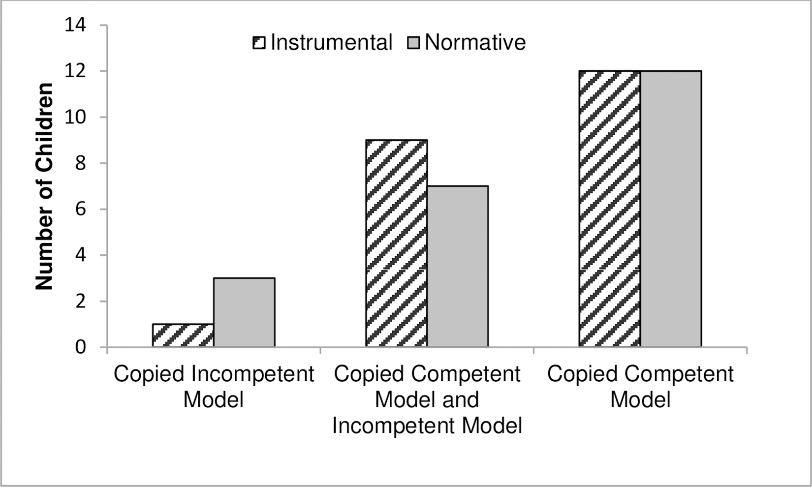
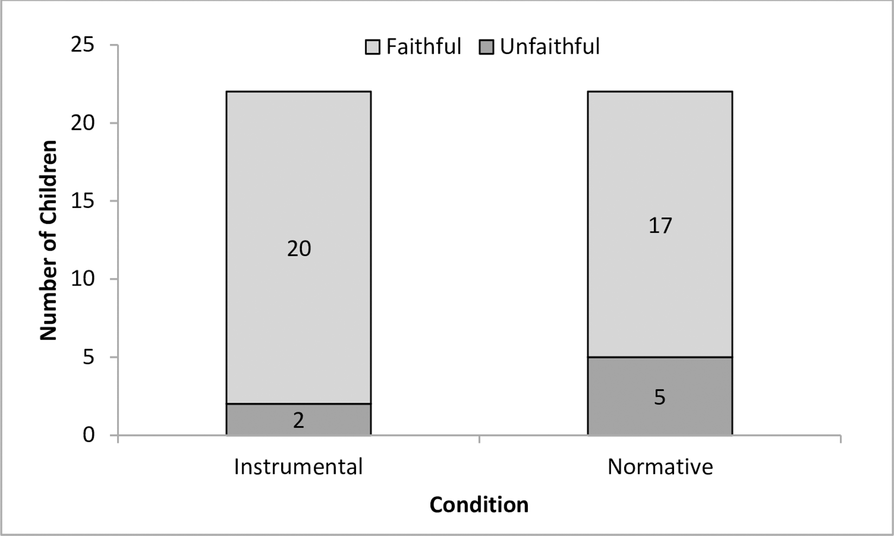
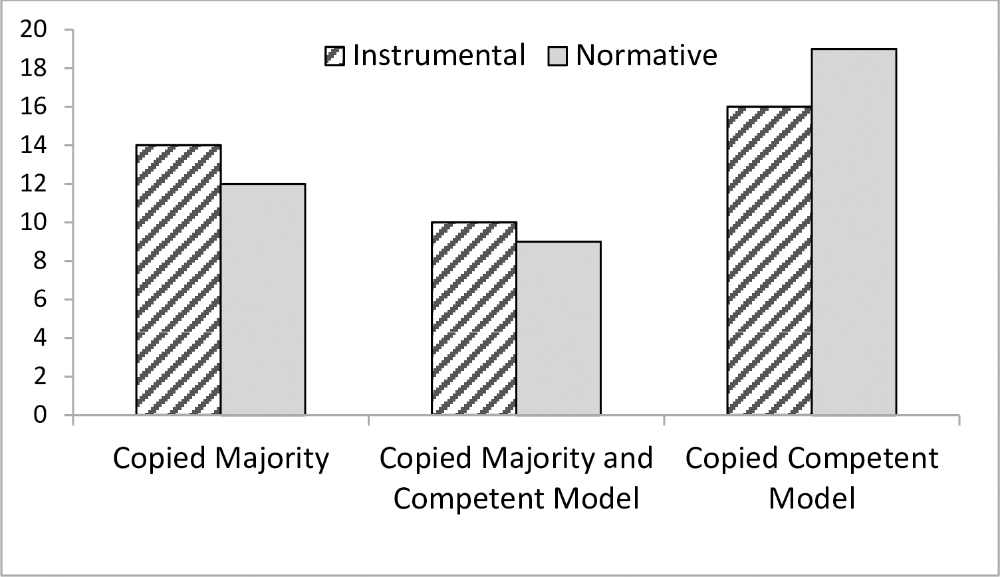
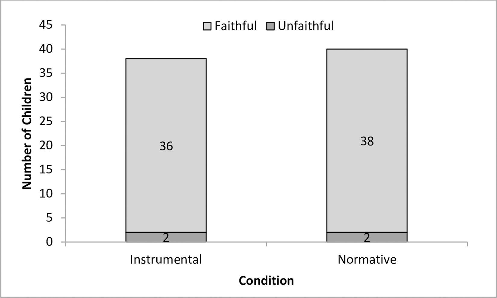

```{r setup, include=FALSE}
knitr::opts_chunk$set(echo = TRUE)
```


```{r include=FALSE}
#install.packages("tidyverse")
#install.packages("rio")
```


```{r include=FALSE}
library(resampledata)
library(tidyverse)
library(rio)
library(ggplot2)
```


## Do Children Copy an Expert or a Majority? Examining Selective Learning in Instrumental and Normative Contexts


This study examined whether instrumental and normative learning contexts differentially influence 4- to 7-year-old children’s social learning strategies; specifically, their dispositions to copy an expert versus a majority consensus

## Experiment 1 :

In Experiment 1, they have tested whether 4-to-7-year-olds selectively copy an instrumentally competent expert over an incompetent individual.They included 4-to-7-year-old children to examine whether there is a developmental progression in the degree of copying faithfully and whether there are differences in development according to context.


### Converting and Reading Dataset1 :


```{r read_data_from_csv,}
#reading the csv file
data_source <- "S1_Dataset.csv"
s1_data <- read_csv(data_source)
#glimpse(s1_data)
```


### Number of children who copied the technique demonstrated by the competent or incompetent model



#### Text Description of Figure 1

Number of children who copied the technique demonstrated by the competent or incompetent model in Experiment 1.

1) From the above data set (s1_data) we need two columns to reproduce our above graph.

2) Their are two types conditions i.e. Instrumental and Normative Conditions

3) In the normative and instrumental conditions 24 children matched the method of the expert model on both test trials.

4) 16 children matched the method of the expert model in at least one test trial and just 4 children matched the method of the incompetent model in both test trials.

5) Each child received a single classification of matching either (i) the competent model both times, (ii) the incompetent model both times, or (iii) both models once each

6) These classifications are found in CompetenceBias column.

7) Now we need to convert these two columns into matrix format,  then plot those values in BarPlot

#### Code to reproduce Figure 1 :

*In Condition (Type : Int) :*
3 - represents Instrumental Condition
4 - represents Normative Condition

*In CompetenceBias (Type : Int) :*
0 - represents Successful copying of Incompetent Model	
1 - represents Successful copying of Competent Model and Incompetent Model
2 - represents Successful copying of Competent Model

```{r}
model_data <- subset(s1_data, select = c(Condition,CompetenceBias))
# omitting na data
model_data <- na.omit(model_data)

model_proportion <- as.data.frame.matrix(table(model_data$CompetenceBias, model_data$Condition))
model_proportion

bind_data <- rbind(model_proportion$`3`,model_proportion$`4`)

barplot(height = bind_data,
        beside = TRUE,
        ylab = "No. of children",
        ylim = c(0,15),
        names.arg = c("Copied IM", "Copied both", "Copied CM"),
        legend.text = c("Instrumental", "Normative"),
        args.legend = list(x="top"))


```

### Number of children who copied the action faithfully and unfaithfully in both conditions in Experiment 1.



#### Text Description of Figure 2

1) To examine how children reproduced what they saw, children’s repetition of the actions in two categories: those who copied ‘unfaithfully' in so far as they copied the action only once, and those who copied the model ‘faithfully’ in that they repeated the action more than once.

2) We can find those values in In_or_Efficient_copiers column.

3) By using ggplot we can plot the above data


#### Code to reproduce Figure 2 :

*In Condition (Type : Int) :*
3 - represents Instrumental Condition
4 - represents Normative Condition

*In In_or_Efficient_copiers (Type : Int) :*
1 - represents Unfaithful	
2 - represents faithful

```{r}
copy_model <- subset(s1_data, select = c(Condition,In_or_Efficient_copiers))
# omitting na data
copy_model <- na.omit(copy_model)

copymodel <- as.data.frame(table(copy_model$In_or_Efficient_copiers, copy_model$Condition))
copymodel

ggplot(data=copymodel, aes(x=Var2, y=Freq, fill=Var1)) +
  geom_bar(stat="identity" ,colour="black")+
  xlab("Condition") + ylab("Total no of children") +
  scale_x_discrete("Conditions",labels = c("Instrumental", "Normative")) +
  scale_fill_discrete(name="Copy Types", breaks=c("1", "2"),
                         labels=c("Unfaithful", "Faithful"))

```


### Replication of analyses/results

Across the normative and instrumental conditions 24 children matched the method of the expert model on both test trials. An additional 16 children matched the method of the expert model in at least one test trial and just 4 children matched the method of the incompetent model in both test trials. Each child received a single classification of matching either
(i) the competent model both times
(ii) the incompetent model both times
(iii) both models once each. 

Chi-square goodness-of-fit tests against the expected chance distribution across these possibilities of 1:1:2 showed that children were more likely to match the method of the competent model than the incompetent model in both instrumental and normative conditions.

#### Chi square Test for Instrumentational Condition.

```{r}
model_proportion

Inst_condtn <- model_proportion[,1]
Inst_condtn

IC <- as.data.frame( Inst_condtn, drop=false)
IC

## chi square test for instrumentation condition for the given distribution 1:1:2

chisq.test(IC, p=c(1/4,1/2,1/4)) 
```


#### Chi square Test for Normative Condition.

```{r}

Norm_condtn <- model_proportion[,2]
Norm_condtn

NC <- as.data.frame( Norm_condtn, drop=false)
NC

## chi square test for instrumentation condition for the given distribution 1:1:2

chisq.test(NC, p=c(1/4,1/2,1/4)) 
```

#### chisqure test for enite data

```{r}

total <- as.data.frame(model_proportion, drop=false)

chisq.test(total) 
```

#### Binomial Test for Instrumental Condition

```{r}
binom.test(20,22,1/2)
```
p<0.001

#### Binomial Test for Normative Condition

```{r}
binom.test(17,22,1/2)
```

p<0.001


### Additional plots


#### Age Vs Gender

```{r}

Gen_age <- subset(s1_data, select = c(Gender,Age))
# omitting na data
Gen_age <- na.omit(Gen_age)

data_Gen_age <- as.data.frame.matrix(table(Gen_age$Gender, Gen_age$Age))
data_Gen_age

bind_data <- rbind(data_Gen_age$`4`,data_Gen_age$`5`,data_Gen_age$`6`,data_Gen_age$`7`)

barplot(height = bind_data, main = "No. Boys and Girs in different Age groups",
        beside = TRUE,
        ylab = "No. of children",
        ylim = c(0,15),
        names.arg = c("Boys","Girls"),
        legend.text = c("4Year", "5Year" ,"6Year" , "7Year"),
        args.legend = list(x="top"))

```

#### No of boys and girls in Instrumental and Normative Conditions 

```{r}
# selecting three columns
Gen_cond <- subset(s1_data, select = c(Gender,Condition))
# omitting na data
Gen_cond <- na.omit(Gen_cond)

data_Gen_cond <- as.data.frame.matrix(table(Gen_cond$Gender, Gen_cond$Condition))

bind_data <- rbind(data_Gen_cond$`3`,data_Gen_cond$`4`)


barplot(height = bind_data,main = "No. Boys and Girs in different Instrumental & Normative Conditions",
        beside = TRUE,
        ylab = "No. of children",
        ylim = c(0,16),
        names.arg = c("Boys","Girls"),
        legend.text = c("Instrumental", "Normative"),
        args.legend = list(x="top"))

```

#### No. Boys and Girs in Copied in three diff Methods


```{r}
# selecting three columns
Gen_Comp <- subset(s1_data, select = c(CompetenceBias,Gender))
# omitting na data
Gen_Comp <- na.omit(Gen_Comp)

data_Gen_Comp <- as.data.frame.matrix(table( Gen_Comp$CompetenceBias, Gen_Comp$Gender))
data_Gen_Comp

bind_data <- rbind(data_Gen_Comp$`1`,data_Gen_Comp$`2`)

barplot(height = bind_data, main=" boys Vs girls who copied the technique demonstrated by the competent or incompetent model ",
        beside = TRUE,
        ylab = "No. of children",
        ylim = c(0,20),
        names.arg = c("Copied Incompetent Model", "Copied both", "Copied Competent Model"),
        legend.text = c("Boys", "Girls"),
        args.legend = list(x="top"))

```


### An additional analysis

T - Test:

```{r}
model_proportion

t.test(model_proportion$`3`,model_proportion$`4`,data=model_proportion,mu=1, paired = TRUE, var.equal = TRUE, conf.level=.95)

```

### An additional analysis using permutation tests


```{r}
model_data <- subset(s1_data, select = c(Condition,CompetenceBias))
# omitting na data
model_data <- na.omit(model_data)
model_data

```


```{r}

observed = 1

#set.seed(0)
B <- 1000  #set number of times to repeat this process
 result <- numeric(B) # space to save the random differences
 for(i in 1:B)
  {
  index <- sample(1,22, replace = TRUE) 
  result[i] <- mean(Norm_condtn[index]) - mean(Norm_condtn[-index])
 }
 
(sum(result >= observed)+1)/(B + 1)*2  #P-value


```

the p value is almost same

## Experiment 2 :

In Experiment 2, they have tested 40 4-to-5-year-olds, (M = 59 months, range = 48–71, 19 girls) and 40 6-to-7-year-olds, (M = 82 months, range = 72–94, 30 girls). Forty children (20 from each age group) were assigned to an instrumental condition and 40 children were assigned to a normative condition.An additional five children were tested but excluded due to technical/experimenter error (n = 1), shyness (n = 2), and because a caregiver prompted the child what to do in the test trials (n = 2).


### Converting and Reading Dataset2 :


```{r}
# reading .csv file 
data_source <- "S2_Dataset.csv"
s2_data <- read_csv(data_source)
#glimpse(s2_data)

```

### Number of children who copied the technique demonstrated by the competent model or the majority in Experiment 2.




#### Text Description of figure 3

1) From the above data set (s2_data) we need two columns to reproduce our above graph.

2) Their are two types conditions i.e. Instrumental and Normative Conditions

3) In the normative and instrumental conditions 24 children matched the method of the expert model on both test trials.

4) 16 children matched the method of the expert model in at least one test trial and just 4 children matched the method of the incompetent model in both test trials.

5) Each child received a single classification of matching either (i) the competent model both times, (ii) the incompetent model both times, or (iii) both models once each

6) These classifications are found in CompetenceBias column.

7) Now we need to convert these two columns into matrix format,  then plot those values into BarPlot.


#### Code to reproduce figure 3 :


*In Condition (Type : Int) :*
1 - represents Instrumental Condition
3 - represents Normative Condition

*In CompetenceBias (Type : Int) :*
0 - represents Successful copying of majority
1 - represents Successful copying of Competent Model and Majority Model	
2 - Successful copying of  Competent Model


```{r}
# selecting three columns
data_set2 <- subset(s2_data, select = c(Condition,CompetenceBias))
# omitting na data
data_set2 <- na.omit(data_set2)
glimpse(data_set2)

```


```{r}
data2 <- as.data.frame.matrix(table(data_set2$CompetenceBias, data_set2$Condition))
data2
```


```{r}

bind_data <- rbind(data2$`1` , data2$`3`)
bind_data

barplot(height = bind_data,
        beside = TRUE,
        ylab = "No. of children",
        ylim = c(0,20),
        names.arg = c("Copied Majority", "Copied both", "Copied Competent Model"),
        legend.text = c("Instrumental", "Normative"),
        args.legend = list(x="top"))

```


### Number of children who over, under, or exactly copied the action in both conditions and test trials in Experiment 2.




#### Text Description of figure 4 :

1) To examine how children reproduced what they saw, children’s repetition of the actions in two categories: those who copied ‘unfaithfully insofar as they copied the action only once, and those who copied the model ‘faithfully’ in that they repeated the action more than once.

2) We can find those values in In_or_Efficient_copiers column.

3) By using ggplot we can plot the above data


#### Code to reproduce figure 4 :

*In Condition (Type : Int) :*
1 - represents Instrumental Condition
3 - represents Normative Condition

*In In_or_Efficient_copiers (Type : Int) :* 
1 - represents Unfaithful	
2 - represents faithful

```{r}
copiers <- subset(s2_data, select = c(Condition,In_or_Efficient_copiers))
# omitting na data
copiers <- na.omit(copiers)
copiers
```


```{r}
copiers_table <- as.data.frame(table(copiers$In_or_Efficient_copiers, copiers$Condition))
copiers_table

```


```{r}

ggplot(data=copiers_table, aes(x=Var2, y=Freq, fill=Var1)) +
  geom_bar(stat="identity" ,colour="black")+
  xlab("Condition") + ylab("Total no of children") +
  scale_x_discrete("Conditions",labels = c("Instrumental", "Normative")) +
  scale_fill_discrete(name="Copy Types", breaks=c("1", "2"),
                         labels=c("Unfaithful", "Faithful"))
```


#### Number Of children and their explanations for their chosen method in experiment 2


|   |Competent Model|Majority|Causal Expl|Functional Expl|Pref|I dont know|
|----|-----|-----|----|----|----|----|
|Copied Majorit|1|1|4|4|5|11|
|Ambivalent|1|1|2|2|4|10|
|Copied Competent Model|10|0|3|1|4|18|

*Causal Expl - Causal Explanation*
*Functional Expl - Functional Explanation*
*Pref - Preference*


### Replication of analyses/results

#### Chi square Test for Instrumentational Condition.

```{r}

Inst_condtn <- data2[,1]
Inst_condtn

IC <- as.data.frame( Inst_condtn, drop=false)
IC

## chi square test for instrumentation condition for the given distribution 1:1:2

chisq.test(IC, p=c(1/4,1/2,1/4)) 
```


#### Chi square Test for Normative Condition.

```{r}

Norm_condtn <- data2[,2]
Norm_condtn

NC <- as.data.frame( Norm_condtn, drop=false)
NC

## chi square test for instrumentation condition for the given distribution 1:1:2

chisq.test(NC, p=c(1/4,1/2,1/4)) 
```

#### chisqure test for enite data

```{r}

cm <- data2[3,]
cm

C_M <- as.data.frame( cm, drop=false)
C_M

chisq.test(C_M)
```

#### chisquare test for 4-5 years Instrumental Condition

```{r}
data_CCA <- subset(s2_data, select = c(CompetenceBias,Condition,Age))
data_CCA

data_CCA <- na.omit(data_CCA)
data_CCA

instrumental_condition <-  subset(data_CCA, Condition=="1"& Age %in% c(4,5))
instrumental_condition


IC_four_five_years<- as.data.frame.matrix(table( instrumental_condition$CompetenceBias, instrumental_condition$Age))
IC_four_five_years


IC_four_five_years <- matrix(c(7,6,7) , ncol=1 , nrow=3 , byrow=TRUE , 
dimnames = list( c("0","1","2"),c("4-5 years")))
  
IC_four_five_years <- as.table(IC_four_five_years)
IC_four_five_years

chisq.test(IC_four_five_years, p=c(1/4,1/2,1/4)) 
```

#### chisquare test for 4-5 years Normative Condition

```{r}

Normative_condition <-  subset(data_CCA, Condition=="3"& Age %in% c(4,5))
Normative_condition


NC_four_five_years<- as.data.frame.matrix(table( Normative_condition$CompetenceBias, Normative_condition$Age))
NC_four_five_years


NC_four_five_years <- matrix(c(7,4,9) , ncol=1 , nrow=3 , byrow=TRUE , 
dimnames = list( c("0","1","2"),c("4-5 years")))
  
NC_four_five_years <- as.table(NC_four_five_years)
NC_four_five_years

chisq.test(NC_four_five_years, p=c(1/4,1/2,1/4)) 
```


#### chisquare test for 6-7 years Instrumental Condition

```{r}


instrumental_condition <-  subset(data_CCA, Condition=="1"& Age %in% c(6,7))
instrumental_condition


IC_six_seven_years<- as.data.frame.matrix(table( instrumental_condition$CompetenceBias, instrumental_condition$Age))
IC_six_seven_years


IC_six_seven_years <- matrix(c(6,4,10) , ncol=1 , nrow=3 , byrow=TRUE , 
dimnames = list( c("0","1","2"),c("6-7 years")))
  
IC_six_seven_years <- as.table(IC_six_seven_years)
IC_six_seven_years

chisq.test(IC_six_seven_years, p=c(1/4,1/2,1/4)) 
```

#### chisquare test for 6-7 years Normative Condition

```{r}

Normative_condition <-  subset(data_CCA, Condition=="3"& Age %in% c(6,7))
Normative_condition


NC_six_seven_years<- as.data.frame.matrix(table( Normative_condition$CompetenceBias, Normative_condition$Age))
NC_six_seven_years


NC_six_seven_years <- matrix(c(7,4,9) , ncol=1 , nrow=3 , byrow=TRUE , 
dimnames = list( c("0","1","2"),c("6-7 years")))
  
NC_six_seven_years <- as.table(NC_six_seven_years)
NC_six_seven_years

chisq.test(IC_four_five_years, p=c(1/4,1/2,1/4)) 
```

```{r}
Ic_total <- subset(data_CCA, Condition=="1")
Ic_total

Ic_total<- as.data.frame.matrix(table( Ic_total$CompetenceBias, Ic_total$Age))
Ic_total


IC_total <- matrix(c(6,7,4,4,10,9) , ncol=2 , nrow=3 , byrow=TRUE , 
dimnames = list( c("0","1","2"),c("4-5","6-7")))
  
IC_total <- as.table(IC_total)
IC_total

chisq.test(IC_total,p=c(1/4,1/2,1/4)) 
```


#### Binomial Test for Instrumental Condition

```{r}
binom.test(36,40,1/2)
```
p<0.001

#### Binomial Test for Normative Condition

```{r}
binom.test(38,40,1/2)
```

p<0.001


### Additional plots


#### Age Vs Gender

```{r}

Gen_age <- subset(s2_data, select = c(Gender,Age))
# omitting na data
Gen_age <- na.omit(Gen_age)

data_Gen_age <- as.data.frame.matrix(table(Gen_age$Gender, Gen_age$Age))
data_Gen_age

bind_data <- rbind(data_Gen_age$`4`,data_Gen_age$`5`,data_Gen_age$`6`,data_Gen_age$`7`)


barplot(height = bind_data,
        beside = TRUE,
        ylab = "No. of children", main="Age Vs Gender",
        ylim = c(0,25),
        names.arg = c("Boys","Girls"),
        legend.text = c("4Year", "5Year" ,"6Year" , "7Year"),
        args.legend = list(x="top"))

```

#### No of boys and girls in Instrumental and Normative Conditions 

```{r}
# selecting three columns
Gen_cond <- subset(s2_data, select = c(Gender,Condition))
# omitting na data
Gen_cond <- na.omit(Gen_cond)


data_Gen_cond <- as.data.frame.matrix(table(Gen_cond$Gender, Gen_cond$Condition))
data_Gen_cond

bind_data <- rbind(data_Gen_cond$`1`,data_Gen_cond$`3`)


barplot(height = bind_data,
        beside = TRUE,
        ylab = "No. of children", main="No of boys Vs girls in Instrumental and Normative Conditions",
        ylim = c(0,30),
        names.arg = c("Boys","Girls"),
        legend.text = c("Instrumental", "Normative"),
        args.legend = list(x="top"))

```

#### " boys Vs girls who copied the technique demonstrated by the competent or incompetent model "


```{r}
# selecting three columns
Gen_Comp <- subset(s2_data, select = c(CompetenceBias,Gender))
# omitting na data
Gen_Comp <- na.omit(Gen_Comp)

data_Gen_Comp <- as.data.frame.matrix(table( Gen_Comp$CompetenceBias, Gen_Comp$Gender))
data_Gen_Comp

bind_data <- rbind(data_Gen_Comp$`1`,data_Gen_Comp$`2`)


barplot(height = bind_data, main = " boys Vs girls who copied the technique demonstrated by the competent or incompetent model ",
        beside = TRUE,
        ylab = "No. of children",
        ylim = c(0,30),
        names.arg = c("Copied Incompetent Model", "Copied both", "Copied Competent Model"),
        legend.text = c("Boys", "Girls"),
        args.legend = list(x="top"))

```


## Conclusion

Conclusion

Following conclusions were made from both the experiments.

1) It demonstrates that children will reliably copy a model who has been shown to be successful in an action-based rather than verbal task, and that children reliably copy in two different learning contexts (both instrumental and normative) (Experiment 1). 
This finding contributes to the current debate about whether children generalize expertise to other domains. 
2) The study adds to the small but growing literature of how children learn skills and actions selectively (Experiments 1 and 2), complementing the larger existing corpus of language studies.

3) The present study demonstrates that young children as a group are equally likely to copy a competent individual or a majority when learning both instrumental and normative skills (Experiment 2) but that individuals may prefer one strategy consistently. Future work may further explore the individual differences this suggests, and their developmental origins.