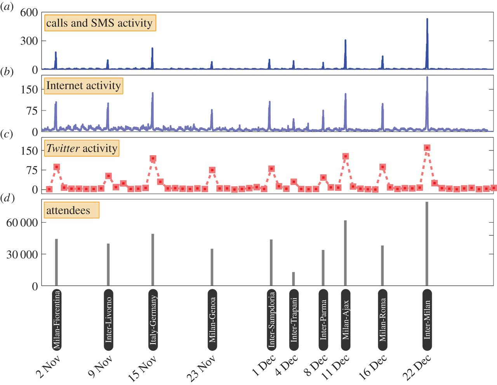
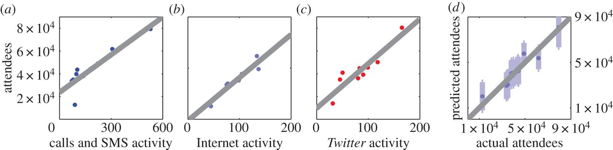
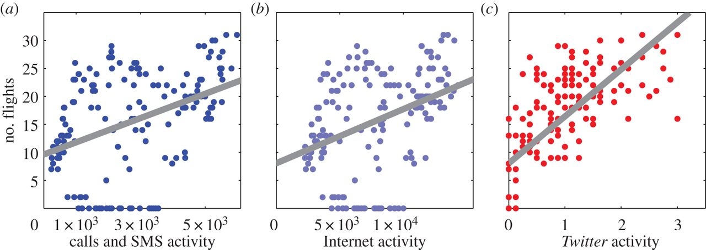

```{r setup, include=FALSE}
library(ggplot2)
library(scales)
library(grid)
library(plyr)
library(gridExtra)
knitr::opts_chunk$set(echo = TRUE)
```
1. Read dataset into R

```{r import}
san_siero.attendees = read.csv('./data/Attendees_San_Siro.csv')
san_siero.phone_data = read.csv('./data/San_Siro_Mobile_Phone_Data.csv')
san_siero.twitter_data = read.csv('./data/San_Siro_Twitter_Data.csv')

linate.data = read.csv('./data/Linate_Data.csv')
linate.flight_schedule = read.csv('./data/Linate_Flights_Schedule.csv')

san_siero.phone_data$Timestamp = as.Date(strptime(san_siero.phone_data$Timestamp, 
                                                  "%Y-%m-%d %H:%M:%S"))
san_siero.twitter_data$Timestamp = as.Date(san_siero.twitter_data$Timestamp)
san_siero.attendees$Date = as.Date(san_siero.attendees$Date)
```

2. HLO  
    a. dplyr::glimpse(df)
```{r}
dplyr::glimpse(san_siero.attendees)
```
Table 1. Glimpse of Attendee Data - In order to combine, we will need to include N/A values when including the Attendees data.   
  
```{r} 
dplyr::glimpse(san_siero.phone_data)
```
Table 2. Glimpse of Phone Data  
  
```{r}
dplyr::glimpse(san_siero.twitter_data)
```
Table 3. Glimpse of Twitter Data  
  
```{r}
dplyr::glimpse(linate.data)
```
Table 4. Glimpse of Combined Data  
  
```{r}
dplyr::glimpse(linate.flight_schedule)
```
Table 5. Glimpse of Flight Data 


3. Variable Types
The major data type we will use to connect all the data together will be date/timestamp. For some of the data, namely the Call/SMS Activity and Internet Activity, it is broken down by hour. For the majority of the replication we will be group these by date in order to incorporate the remainder of the data. We have also considered looking at trends in daily use, attempting to find a trend across similar days of the week.  
The dependent variables are a mixture of integer and float variables.  

4. Variable Scales:
    a. Independent Values(Date/Time)  
        i. Date (MM/DD/YYYY and YYYY/MM/DD)
        ii. Date/Time (YYYY-MM-DD HH:MM:SS or MM/DD/YYYY HH:MM) - hourly and 10 min intervals
    b. Dependent Variables
        i. Calls and SMS Activity - Float values, rescaled using an unknown value (same value for both) - taken every 10 min
        ii. Internet Activity - Float values, rescaled using an unknown value (different from i.) - taken every 10 min
        iii. Twitter Activity - Integer values, tweets per hour
        iv. Airport Arrival/Departures - Integers, numbers of flights
            *  proxy indicator of number of passengers created by combining departures in next 2 hours, arrivals in past 1 hour
5. General Weirdness

I have found that some of the data is hard to naturally connect, given the arbitrary numbers assigned. It may make more sense to compare quantiles as opposed to actual data, since some of the data has been modified by varying unknown factors. Also, I noticed that the graph plotting flight data v various types of activity is less than convincing (atleast visually). I would like to try and make this analysis more valuable.  
Additionally, the data used for the flight arrivals/departures is not for the period observed for call/SMS/internet/twitter data. The researchers took the liberty of assuming that the day of week will be good enough to draw connections to the data. We find that this will likely not be true, since the activity data was taken during a holiday season, which should include a higher volume of flights than the data included.  

6. Basic descriptive statistics
    a. Unit of observation (unique identifier)
        i. Dates and Times
        ii. Arriving and Departing Flights
            *  From this value a proxy acitivy counter is developed
        iii. Hourly Counts of Tweets (Airport)
        iv. Daily Counts of Tweets (Stadium)
        v. Attendees to Football Match
        vi. Calls and SMS Activity
        vii. Internet Activity
    b. central location
    c. spread
    d. shape
7. Plots
  
### Mobile Phone and <i>Twitter</i> Activity in football stadium Stadio San Siro.  
  
  
  
  
Figure 2. Here is the explanation given by the authors of the paper:  
  
>  Mobile phone and Twitter activity in football stadium Stadio San Siro. (a) We depict the time series of mobile phone call and SMS activity recorded in the cell in which the football stadium is located, during the period of analysis between 1 November 2013 and 31 December 2013. The time series is plotted at 10 min granularity. (b) Similarly, we depict the time series of Internet connection activity in the cell in which Stadio San Siro is located, at 10 min granularity. (c) Finally, we depict the daily counts of tweets recorded within the vicinity of the stadium. (d) We determine the dates of football matches which took place during this period, and plot the number of attendees which were recorded at each of these matches. Visual inspection reveals a remarkable alignment between the spikes that can be observed in the communication activities and the dates on which football matches took place. The heights of the spikes bear a strong similarity to the number of attendees at each match.
  
Here is our code to replicate:  
```{r figure2}
p1 <- ggplot(san_siero.phone_data, aes(Timestamp, Calls.and.SMS.Activity)) + 
              geom_step(direction='hv') + theme(axis.text.x=element_blank(),
                                                axis.title.x=element_blank(),
                                                axis.ticks.x=element_blank())
p2 <- ggplot(san_siero.phone_data, aes(Timestamp, Internet.Activity)) + 
              geom_step(direction='hv') + theme(axis.text.x=element_blank(),
                                                axis.title.x=element_blank(),
                                                axis.ticks.x=element_blank())
p3 <- ggplot(san_siero.twitter_data, aes(Timestamp, Twitter.Activity)) + 
              geom_line() + 
              geom_point() + theme(axis.text.x=element_blank(),
                                   axis.title.x=element_blank(),
                                   axis.ticks.x=element_blank())
p4 <- ggplot(san_siero.attendees, aes(Date, Attendees.at.San.Siro)) + 
              geom_bar(stat='identity') + 
              scale_x_date(limits = c(as.Date('2013-11-01'), as.Date('2013-12-30')))

grid.draw(rbind(ggplotGrob(p1), 
                ggplotGrob(p2), 
                ggplotGrob(p3), 
                ggplotGrob(p4), size="last"))
```
  
### Comparing football match attendance figures to mobile phone and Twitter activity.  
  
  
  
Figure 3. Here is the explanation given by the authors of the paper:  

>  Comparing football match attendance figures to mobile phone and Twitter activity. (a) We investigate whether there is a relationship between the number of people attending each football match and the recorded mobile phone call and SMS activity inside the stadium. We find a linear relationship between these two variables (adjusted R^2^=0.771, N=10, p<0.001, ordinary least-squares regression). (b) Similarly, we find a pattern consistent with a linear relationship between Internet connection activity in the stadium and the number of attendees at each match (adjusted R^2^=0.937, N=10, p<0.001, ordinary least-squares regression). (c) We also observe a linear relationship between Twitter activity in the stadium and the number of match attendees (adjusted R^2^=0.855, N=10, p<0.001, ordinary least-squares regression). (d) We explore whether this relationship could be exploited to infer the number of attendees from communication data if no other measurements were available. Using data on Internet activity, we build a linear regression model using only nine out of the 10 football matches and then predict the attendance at the 10th match. We then repeat this leaving a different match out every time. Here, we plot the resulting estimates and their 95% prediction intervals. We find that the actual number of attendees falls within the 95% prediction interval for all 10 matches.

Here is our code to replicate:  
```{r figure3}
san_siero.daily_data <- aggregate(san_siero.phone_data$Calls.and.SMS.Activity, 
                                  by=list(Category=san_siero.phone_data$Timestamp), 
                                  FUN=sum)
san_siero.daily_data <- rename(san_siero.daily_data, c("x"="Calls.and.SMS.Activity"))
san_siero.daily_data$Internet.Activity = aggregate(san_siero.phone_data$Internet.Activity, 
                                         by=list(Cateogry=san_siero.phone_data$Timestamp), 
                                         FUN=sum)$x
san_siero.daily_data$Twitter.Activity = san_siero.twitter_data$Twitter.Activity
san_siero.daily_data <- rename(san_siero.daily_data, c("Category"="Date"))
san_siero.daily_attending_data <- merge(san_siero.daily_data, san_siero.attendees, 
                                        by="Date")

p1 <- ggplot(san_siero.daily_attending_data, aes(Calls.and.SMS.Activity, 
                                                 Attendees.at.San.Siro)) + geom_point()
p2 <- ggplot(san_siero.daily_attending_data, aes(Internet.Activity, 
                                                 Attendees.at.San.Siro)) + geom_point()
p3 <- ggplot(san_siero.daily_attending_data, aes(Twitter.Activity, 
                                                 Attendees.at.San.Siro)) + geom_point()
grid.arrange(p1, p2, p3, ncol=3, nrow=1, respect=TRUE)
```
  
### Parallel analysis of the relationship between mobile phone and Twitter data and the number of passengers at Linate Airport.  
  
  
  
Figure 4. Here is the explanation given by the authors of the paper:  

>  Parallel analysis of the relationship between mobile phone and Twitter data and the number of passengers at Linate Airport. (a) We create a proxy indicator for the number of passengers at Linate Airport in each hour by calculating the number of flights departing in the following 2 hours or arriving in the previous hour. We compare this proxy indicator to the average mobile phone call and SMS activity recorded for each hour in a week, in the cells in which the airport is located. We find that greater activity corresponds to a greater estimated number of passengers (adjusted R^2^=0.175, N=168, p<0.001, ordinary least-squares regression). The relationship we find is weaker than that found for the football attendance figures, but remarkable given the coarse nature of our estimate of the number of passengers. (b) We then explore the relationship between the proxy indicator of the number of passengers and Internet connection activity recorded in the cells in which the airport is located. Again, we find that greater Internet activity corresponds to a higher number of passengers (adjusted R^2^=0.143, N=168, p<0.001, ordinary least-squares regression). (c) As a final example, we consider Twitter activity recorded in the cells in which the airport is located. Again, we consider the average number of tweets recorded during each of the 168 hours in a week, over the eight week period of our analysis. Here, we find a stronger relationship between the estimated number of passengers and activity on Twitter (adjusted R^2^=0.510, N=168, p<0.001, ordinary least-squares regression).
 
Here is our code to replicate (including the python code to aggregate data as in the paper):  

```{python3 figure4_wrangling}
import csv
import datetime
converted_data = {}
days_to_skip = set(['2013-11-01', '2013-11-02', '2013-11-03', '2013-12-31', '2013-12-30'])
with open('./data/Linate_Flights_Schedule.csv') as csvfile:
    content = csv.reader(csvfile, delimiter=',')
    next(content, None)
    list_content = list(content)
    for index, row in enumerate(list_content):
        if row[0].split(' ')[0] in days_to_skip:
            continue
        total_flights = sum([int(row[1]), int(row[2])])
        try:
            total_flights += int(list_content[index+1][1])
        except IndexError:
            pass
        output_day = datetime.datetime.strptime(row[0].split(' ')[0], 
                                                '%Y-%m-%d').strftime('%a')
        converted_data[' '.join([output_day, row[0].split(' ')[1]])] = total_flights
        
with open('./data/Linate_Data.csv') as csvfile:
    content = csv.reader(csvfile, delimiter=',')
    next(content, None)
    list_content = list(content)
    for row in list_content:
        date = row[0].split(' ')[0]
        time = row[0].split(' ')[1]
        day = datetime.datetime.strptime(date, '%Y-%m-%d').strftime('%a')
        row.append(converted_data[' '.join([day, time])])
        
with open('./data/Linate_wrangled.csv', 'w') as csvfile:
    wr = csv.writer(csvfile, delimiter=',', lineterminator='\n')
    wr.writerow(['Timestamp', 
                 'Calls.and.SMS.Activity', 
                 'Internet.Activity', 
                 'Twitter.Activity', 
                 'Flights'])
    wr.writerows([row for row in list_content])
```


```{r figure4}
linate_flight_data = read.csv('./data/Linate_wrangled.csv')
linate_flight_data$Timestamp = as.Date(strptime(linate_flight_data$Timestamp, 
                                                "%Y-%m-%d %H:%M:%S"))

p1 <- ggplot(linate_flight_data, aes(Calls.and.SMS.Activity, Flights)) + geom_point()
p2 <- ggplot(linate_flight_data, aes(Internet.Activity, Flights)) + geom_point()
p3 <- ggplot(linate_flight_data, aes(Twitter.Activity, Flights)) + geom_point()
grid.arrange(p1, p2, p3, ncol=3, nrow=1, respect=TRUE)
```
